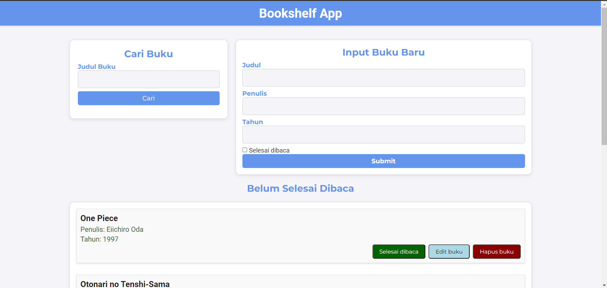

# bookshelf_submission
Dicoding Submission Belajar Membuat Front-end Web untuk Pemula

## Memenuhi Semua Kriteria Wajib

- Menambahkan Buku
- Memindahkan Buku Antar Rak
- Menghapus Data Buku

## Menambahkan Beberapa Fitur Lainnya

- Fitur Pencarian Buku
- Fitur Edit Buku

## Screenshot

*Contoh tampilan website*
